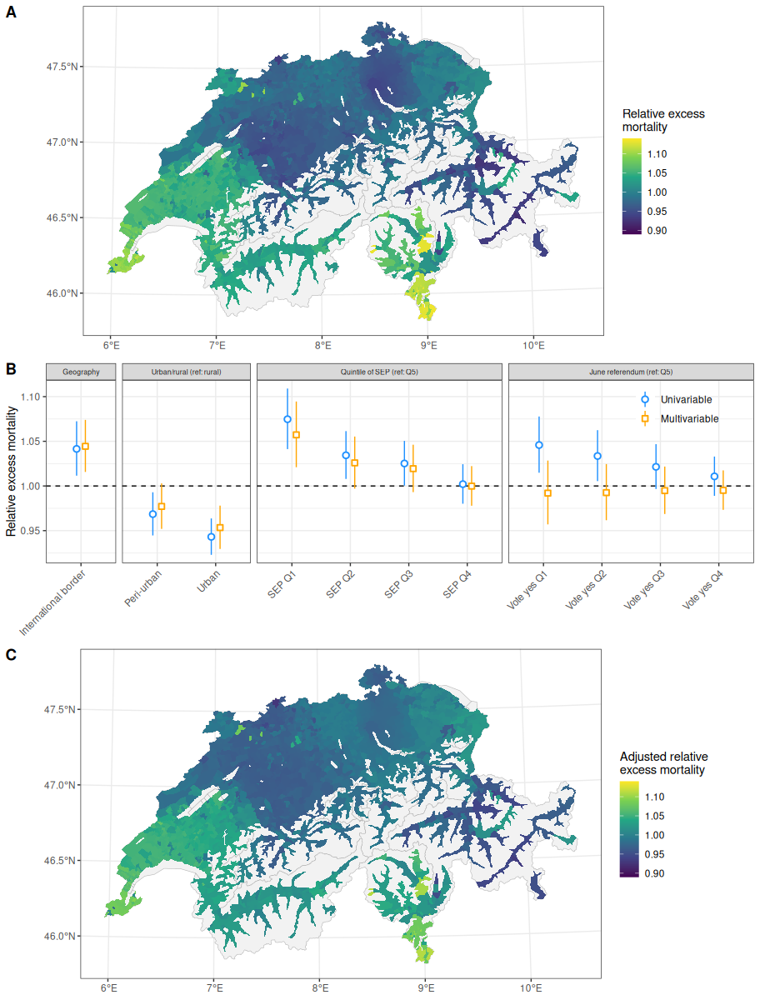

## 2020 excess mortality & voting patterns in CH

Data preparations, miscellaneous explorations and analyses for the forthcoming paper: 

> Riou J, Panczak R, Konstantinoudis G, Egger M (2023) Area-level excess mortality in times of COVID-19 in Switzerland: geographical, socioeconomic and political determinants. *Eur J Public Health*.  

