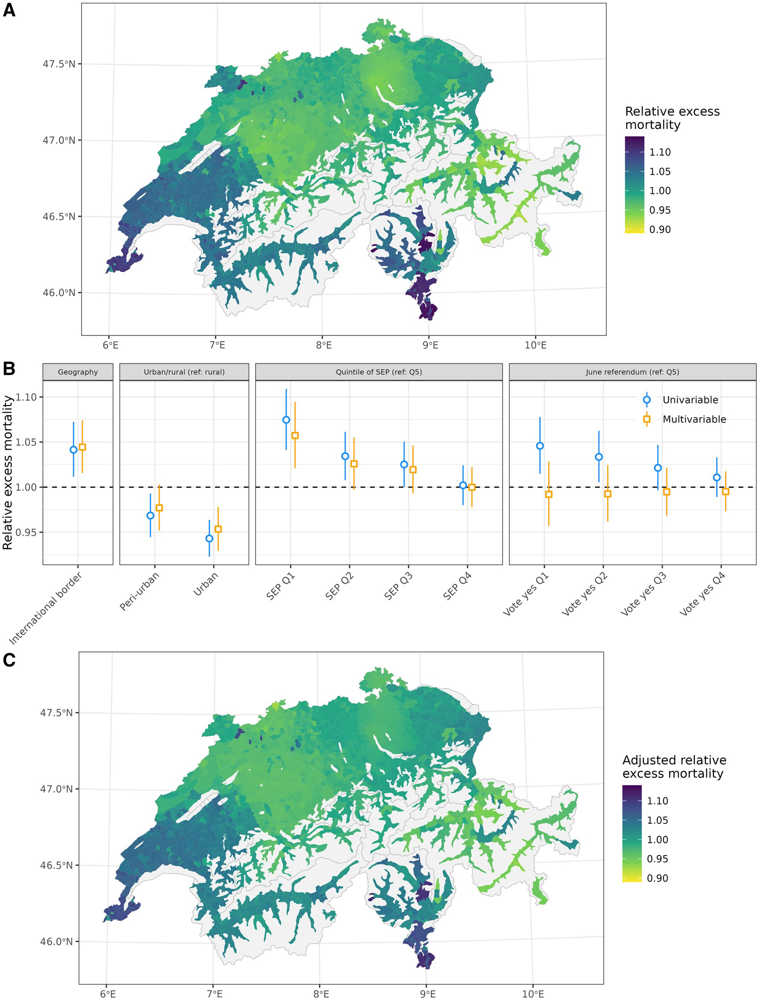

## 2020 excess mortality & voting patterns in CH

Data preparations, miscellaneous explorations and analyses for the forthcoming paper:  

> Riou J, Panczak R, Konstantinoudis G, Egger M (2024) Area-level excess mortality in times of COVID-19 in Switzerland: geographical, socioeconomic and political determinants, *Eur J Public Health*, ckad230, [10.1093/eurpub/ckad230](https://doi.org/10.1093/eurpub/ckad230)  

  

(A) Municipality-specific relative excess mortality in 2020. (B) Local correlates of excess mortality at the municipality level in 2020. (C) Municipality-specific relative excess mortality in 2020 adjusted for aforementioned covariates.  
