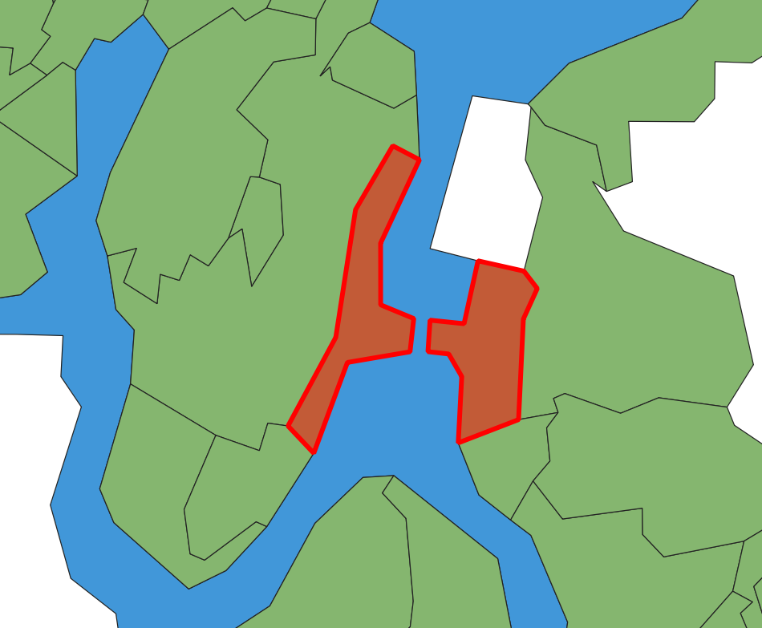
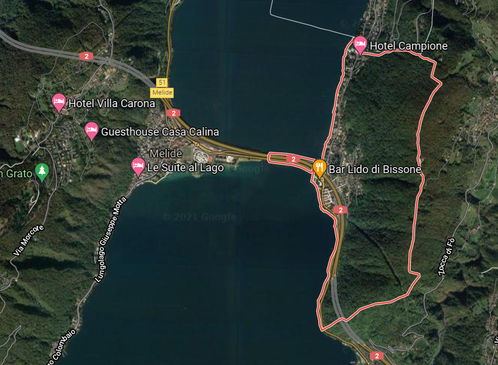
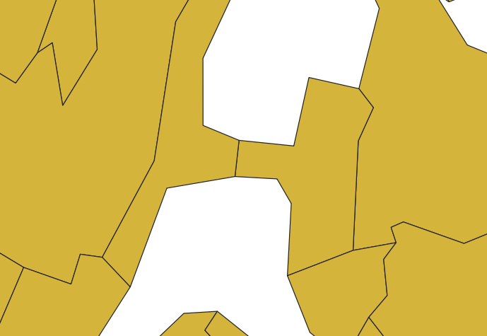
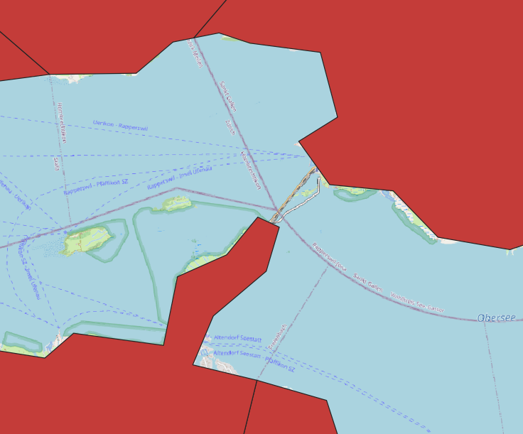
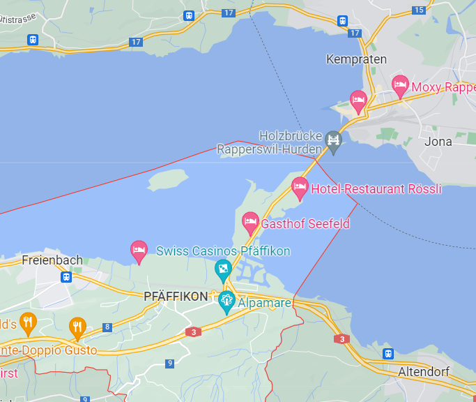
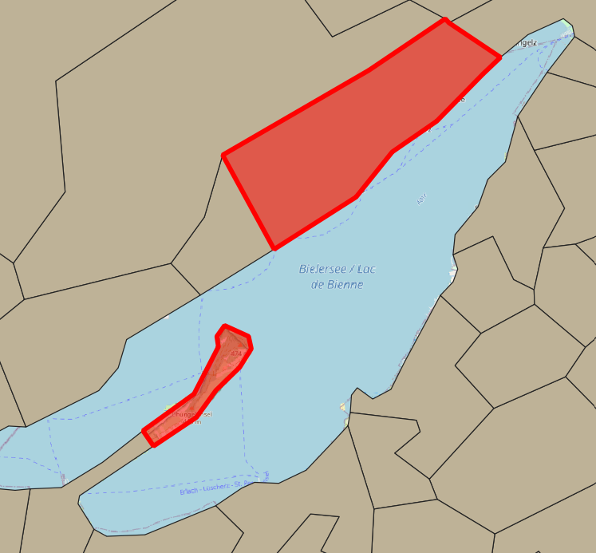
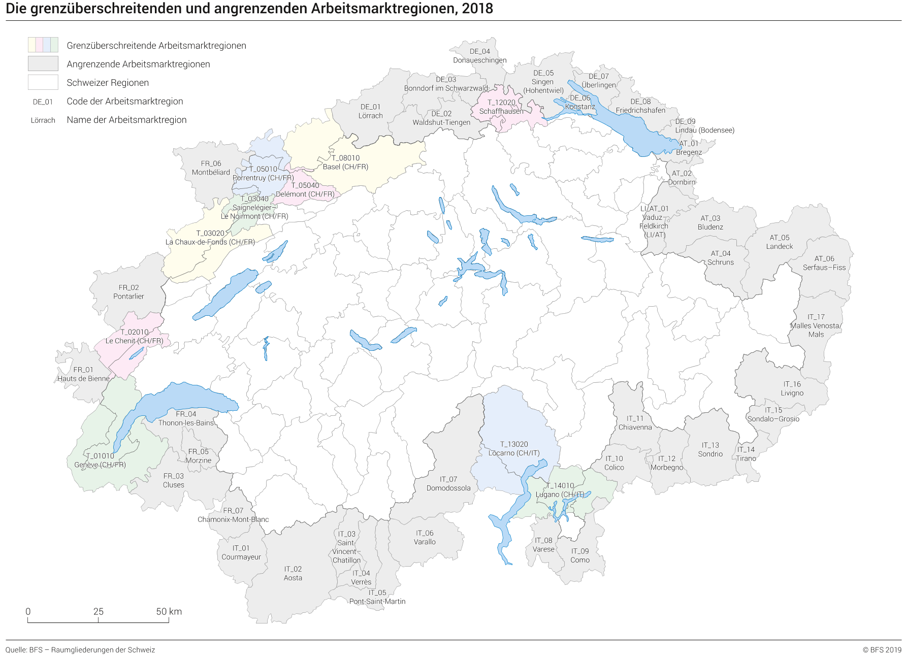

<!-- ----------------------------------------------------- -->

```{r setup, include = FALSE}
set.seed(12345)
options(scipen = 999)
options(max.print = "75")

library(pacman)
p_load(tidyverse, readxl, magrittr, 
       scales, janitor, lubridate, DT,
       spdep, sf, tmap)

tmap_options(check.and.fix = TRUE)

import::from("sjmisc", "frq")
```

```{r conflicts, include = FALSE}
tidyverse::tidyverse_conflicts()

conflicted::conflict_scout()

sf_extSoftVersion()
```

```{r knit-setup, include = FALSE}
knitr::opts_knit$set(root.dir = rprojroot::find_rstudio_root_file())

knitr::opts_chunk$set(cache = FALSE,
                      prompt = FALSE,
                      tidy = FALSE,
                      comment = NA,
                      message = FALSE,
                      warning = FALSE)

knitr::opts_knit$set(width = 75)
```

<!-- ----------------------------------------------------- -->

# BfS geodata 2022  {.tabset}

[Generalisierte Gemeindegrenzen: Geodaten](https://www.bfs.admin.ch/bfs/en/home/services/geostat/swiss-federal-statistics-geodata/administrative-boundaries/generalized-boundaries-local-regional-authorities.assetdetail.21224783.html).

Using version from the `08.02.2022`.  

```{r eval=FALSE}
download.file(url = "https://www.bfs.admin.ch/bfsstatic/dam/assets/21224783/master",
              destfile = "data-raw/BfS/ag-b-00.03-875-gg22.zip",
              method = "curl")

unzip("data-raw/BfS/ag-b-00.03-875-gg22.zip", exdir = "data-raw/BfS/ag-b-00.03-875-gg22")

unlink("data-raw/BfS/ag-b-00.03-875-gg22.zip")
unlink("data-raw/BfS/ag-b-00.03-875-gg22/txt", recursive = TRUE)
unlink("data-raw/BfS/ag-b-00.03-875-gg22/kmz", recursive = TRUE)
unlink("data-raw/BfS/ag-b-00.03-875-gg22/ggg_2022_LV95/ggg_2022_LV95.gdb", recursive = TRUE)
```

```{r warning=FALSE}
gg_raw <-
  st_read("data-raw/BfS/ag-b-00.03-875-gg22/ggg_2022_LV95/shp/g1g22.shp",
          as_tibble = TRUE) %>%
  st_set_crs(2056) %>%
  st_zm(drop = TRUE, what = "ZM")

gg <- 
  st_read("data/BfS/ag-b-00.03-875-gg22/ggg_2022_LV95/shp/g1g22.shp",
          as_tibble = TRUE) %>% 
  st_set_crs(2056) %>% 
  st_zm(drop = TRUE, what = "ZM")

kt <- 
  st_read("data-raw/BfS/ag-b-00.03-875-gg22/ggg_2022_LV95/shp/g1k22.shp",
          as_tibble = TRUE) %>% 
  st_zm(drop = TRUE, what = "ZM") %>% 
  st_transform(2056)

se <- 
  st_read("data-raw/BfS/ag-b-00.03-875-gg22/ggg_2022_LV95/shp/g1s22.shp",
          as_tibble = TRUE) %>% 
  filter(GMDNAME != "Lago di Como") %>% 
  st_zm(drop = TRUE, what = "ZM") %>% 
  st_transform(2056)
```

```{r eval=FALSE, include=FALSE}
unique(st_geometry_type(gg))

table(st_is_valid(gg))
```

```{r include=FALSE}
write_rds(kt, "data/BfS/kt.Rds")
write_rds(se, "data/BfS/se.Rds")

st_write(kt, "data/geo/BfS.gpkg", layer = "kt", append = FALSE, delete_dsn = TRUE)
st_write(se, "data/geo/BfS.gpkg", layer = "se", append = FALSE)
```

## Canton

```{r echo=FALSE}
tm_shape(se, is.master = FALSE) +
  tm_fill(col = "#a7cdf2")  +
  tm_shape(kt) +
  tm_borders()
```

## Municipality

```{r echo=FALSE}
tm_shape(se, is.master = FALSE) +
  tm_fill(col = "#a7cdf2")  +
  tm_shape(gg) +
  tm_borders()
```

## Alternative lakes dataset

Coming from Kartengeometrien ThemaKart - Set «PRO» 2019 available [here](https://www.bfs.admin.ch/bfs/de/home/statistiken/kataloge-datenbanken/karten.assetdetail.7546178.html).

```{r}
se_alt <- 
  st_union(
    st_read("data-raw/BfS/KM04-00-c-suis-2022-q/00_TOPO/K4_seenyyyymmdd/k4seenyyyymmdd11_ch2007Poly.shp",
            as_tibble = TRUE),
    st_read("data-raw/BfS/KM04-00-c-suis-2022-q/00_TOPO/K4_seenyyyymmdd/k4seenyyyymmdd22_ch2007Poly.shp",
            as_tibble = TRUE) )%>% 
  st_transform(2056)
```

That adds few smaller lakes (in blue):

```{r echo=FALSE}
tm_shape(se_alt, is.master = TRUE) +
  tm_fill(col = "blue")  +
  tm_shape(se) +
  tm_fill(col = "grey80")
```

```{r include=FALSE}
write_rds(se_alt, "data/BfS/se_alt.Rds")

st_write(se_alt, "data/geo/BfS.gpkg", layer = "se_alt", append = FALSE)
```

# swisstopo geodata 2022

## Boundaries

`swissBOUNDARIES3D` data available from [here](https://www.swisstopo.admin.ch/de/geodata/landscape/boundaries3d.html).

```{r eval=FALSE}
download.file(url = "https://data.geo.admin.ch/ch.swisstopo.swissboundaries3d/swissboundaries3d_2022-01/swissboundaries3d_2022-01_2056_5728.shp.zip",
              destfile = "data-raw/swisstopo/swissboundaries3d_2022-01_2056_5728.shp.zip",
              method = "curl")

unzip("data-raw/swisstopo/swissboundaries3d_2022-01_2056_5728.shp.zip", 
      exdir = "data-raw/swisstopo/swissboundaries3d_2022-01_2056_5728")

unlink("data-raw/swisstopo/swissboundaries3d_2021-01_2056_5728.shp.zip")
```

```{r}
st_gg <- 
  st_read("data-raw/swisstopo/swissboundaries3d_2022-01_2056_5728/SHAPEFILE_LV95_LN02/swissBOUNDARIES3D_1_3_TLM_HOHEITSGEBIET.shp",
          as_tibble = TRUE) %>% 
  st_zm(drop = TRUE, what = "ZM") %>% 
  st_transform(2056) 

st_kt <- 
  st_read("data-raw/swisstopo/swissboundaries3d_2022-01_2056_5728/SHAPEFILE_LV95_LN02/swissBOUNDARIES3D_1_3_TLM_KANTONSGEBIET.shp",
          as_tibble = TRUE) %>% 
  st_zm(drop = TRUE, what = "ZM") %>% 
  st_transform(2056)
```

```{r eval=FALSE, include=FALSE}
unique(st_geometry_type(st_gg))
unique(st_geometry_type(st_kt))
```

```{r include=FALSE}
write_rds(st_kt, "data/swisstopo/st_kt.Rds")

st_write(st_kt, "data/geo/swisstopo.gpkg", layer = "st_kt", delete_dsn = TRUE, append = FALSE)
```

## Lakes

Additional dataset of lakes was derived from `swissTLM3D_TLM_STEHENDES_GEWAESSER.shp` layer from `swissTLM3D` [dataset](https://www.swisstopo.admin.ch/de/geodata/landscape/tlm3d.html).

```{r eval=FALSE}
# convert lines to polygons, calculate area

# testing is good here:
# "NAME" = 'Bodensee | Lac de Constance | Lago di Costanza | Lai da Constanza'

st_se <- 
  st_read("data-raw/swisstopo/swisstlm3d_2022-03_2056_5728/TLM_GEWAESSER/swissTLM3D_TLM_STEHENDES_GEWAESSER.shp",
          as_tibble = TRUE) %>% 
  st_zm(drop = TRUE, what = "ZM") %>% 
  filter(OBJEKTART == "See") %>% 
  group_by(GEW_LAUF_U) %>% 
  summarise(geometry = st_combine(geometry),
            NAME = first(NAME),
            OBJEKTART = first(OBJEKTART)) %>%
  st_cast("MULTILINESTRING") %>% 
  st_polygonize() %>%
  mutate(area = st_area(.)) %>% 
  ungroup() %>% 
  relocate(geometry, .after = last_col())

st_see22_insel <- 
  st_read("data-raw/swisstopo/swisstlm3d_2022-03_2056_5728/TLM_GEWAESSER/swissTLM3D_TLM_STEHENDES_GEWAESSER.shp",
          as_tibble = TRUE) %>% 
  st_zm(drop = TRUE, what = "ZM") %>% 
  filter(OBJEKTART == "Seeinsel") %>% 
  group_by(GEW_LAUF_U) %>% 
  summarise(geometry = st_combine(geometry),
            NAME = first(NAME),
            OBJEKTART = first(OBJEKTART)) %>%
  st_cast("MULTILINESTRING") %>% 
  st_polygonize() %>% 
  mutate(area = st_area(.)) %>% 
  ungroup() %>% 
  relocate(geometry, .after = last_col())

st_se <- 
  st_difference(st_se, st_union(st_see22_insel)) %>% 
  st_collection_extract("POLYGON") %>% 
  st_zm(drop = TRUE, what = "ZM") %>% 
  st_transform(2056)

unique(st_geometry_type(st_se))

frq(st_is_valid(st_se))

summary(st_se$area)

plot(st_se[, 2])

rm(st_see22_insel); gc()
```

```{r eval=FALSE, include=FALSE}
# st_write(st_se, "data/swisstopo/st_se.gpkg", layer = "lakes", delete_dsn = TRUE)
# st_write(st_see22_insel, "data/swisstopo/st_se.gpkg", layer = "st_see22_insel", append = FALSE)

write_rds(st_se, "data/swisstopo/st_se.Rds") 

st_write(st_se, "data/geo/swisstopo.gpkg", layer = "st_se", append = FALSE)

st_se_sel <- st_se %>% 
  st_filter(se_alt)

write_rds(st_se_sel, "data/swisstopo/st_se_sel.Rds") 

st_write(st_se_sel, "data/geo/swisstopo.gpkg", layer = "st_se_sel", append = FALSE)
```

## Combined

```{r include=FALSE}
st_se_sel <- read_rds("data/swisstopo/st_se_sel.Rds") 
```

Lakes dataset (selecting only `r nrow(se_alt)` largest features from ThemaKart dataset overlap!) was then used to erase area of municipalities that extends over lakes. Issue is described in [#48](https://github.com/RPanczak/ISPM_geo-mortality/issues/48).

```{r warning=FALSE}
st_gg <- 
  st_difference(st_gg, st_union(st_se_sel)) %>% 
  # small slivers of lakes left
  filter(OBJEKTART != "Kantonsgebiet") %>% 
  st_collection_extract("POLYGON") %>% 
  st_zm(drop = TRUE, what = "ZM") %>% 
  st_transform(2056) # %>% 
# group_by(BFS_NUMMER) %<>% 
# summarise(BFS_NUMMER = first(BFS_NUMMER),
#           NAME = first(NAME),
#           GEM_TEIL = max(GEM_TEIL)) %>%
# st_cast("MULTIPOLYGON") 
```

```{r eval=FALSE, include=FALSE}
unique(st_geometry_type(st_gg))

# if needed as POLYGON (not MULTI)
# remove st_collection_extract() above
# and run this one

temp <- rbind(
  st_gg %>%
    filter(st_is(geometry, "POLYGON")),
  
  st_gg %>%
    filter(st_is(geometry, "MULTIPOLYGON")) %>% 
    st_cast("POLYGON")
)

unique(st_geometry_type(temp))
rm(temp); gc()
```

<!-- ----------------------------------------------------- -->

# Important differences

## Resolution

swisstopo files (in blue below) are larger in size (and slower to plot) but offer better resolution and will be used for certain spatial operations (like linking to SEP) whereas BfS data (in red) are smaller in size and faster to plot. Example of municipality Bern:

```{r echo=FALSE}
tm_shape(st_gg %>% filter(BFS_NUMMER == 351)) +
  tm_borders(col = "blue", lwd = 1, alpha = 0.5) +
  tm_shape(gg %>% filter(GMDNR == 351)) +
  tm_borders(col = "red", lwd = 2, alpha = 0.5) +
  tm_layout(
    title = "Different spatial resolutions"
  )
```

## Multipart features

BfS originally stores data as `MULTIPOLYGON`. In such case municipality split over several disconnected areas is stored as *single record*. Example of municipality Monthey which consists of four separate areas:

```{r echo=FALSE}
gg %>% 
  filter(GMDNR == 6153) %>% 
  mutate(GEM_TEIL = "1") %>% 
  select(GEM_TEIL) %>% 
  plot()
```

```{r eval=FALSE, warning=FALSE, include=FALSE}
# if polygons are needed
gg %>%
  filter(GMDNR == 6153) %>%
  st_cast("POLYGON")
```

The same municipality in swisstopo data is stored as **set of** `MULTIPOLYGON` types and is represented by *four separate records* instead of one.

```{r echo=FALSE}
st_gg %>% 
  filter(BFS_NUMMER == 6153) %>%
  select(GEM_TEIL, geometry) %>% 
  plot()
```

That might have some implications in terms of spatial operations (maybe contiguity too?). Data can easily be converted between types if needed.

<!-- ----------------------------------------------------- -->

# Municipality boundaries preparations

## Disconnected boundaries - Lake Lugano

Two communities in TI *Bissone* & *Melide* are disconnected by Lake Lugano in BfS municipality data:

 

In reality communities are indeed connected:

 

That has been manually corrected in GIS and now looks like:

 

Importance of this issue is covered [here](https://doi.org/10.1016/j.sste.2018.04.002).

## Disconnected boundaries - Lake Zurich

Freienbach & Rapperswil-Jona are disconnected on the map of boundaries:



... but connected IRL:

 

That has been fixed manually in GIS.

## Spurious connection

Community of Twann-Tüscherz (in red) is connected to Erlach via small part of the St. Peter's Island.

 

This connection has been removed.

## Non-residential municipalities

Excluding municipalities without residents:

-   `Staatswald Galm`\
-   `Comunanza Cadenazzo/Monteceneri`\
-   `Comunanza Capriasca/Lugano`

We should not expect any cases there!

```{r eval=FALSE, include=FALSE}
gg %>% 
  st_drop_geometry() %>% 
  filter(GMDNR %in% c(2391, 5391, 5394)) %>% 
  select(GMDNR, GMDNAME)
```

```{r include=FALSE}
gg %<>% 
  filter(! GMDNR %in% c(2391, 5391, 5394)) %>% 
  select(GMDNR, GMDNAME, KTNR) %>% 
  arrange(GMDNR)

# st_gg %>% 
#   st_drop_geometry() %>% 
#   filter(BFS_NUMMER %in% c(2391, 5391, 5394)) %>% 
#   select(BFS_NUMMER, NAME)

st_gg %<>% 
  filter(! BFS_NUMMER %in% c(2391, 5391, 5394)) %>% 
  # exclude lakes
  filter(OBJEKTART != "Kantonsgebiet") %>% 
  # exclude FL & enclaves
  filter(ICC == "CH") %>% 
  select(BFS_NUMMER, NAME, KANTONSNUM, GEM_TEIL) %>% 
  rename(GMDNR = BFS_NUMMER,
         GMDNAME = NAME,
         KTNR = KANTONSNUM) %>% 
  arrange(GMDNR)
```

```{r echo=FALSE, include=FALSE}
# should be exact overlap
stopifnot(
  gg %>%
    filter(! GMDNR %in% st_gg$GMDNR) %>% 
    nrow() == 0
)

stopifnot(
  st_gg %>%
    filter(! GMDNR %in% gg$GMDNR) %>% 
    nrow() == 0
)
```

<!-- ----------------------------------------------------- -->

# Labour market areas 2018

## Data sources

More info [here](https://www.bfs.admin.ch/bfs/de/home/aktuell/neue-veroeffentlichungen.gnpdetail.2019-0439.html).

```{r}
raum <- read_xlsx("data-raw/BfS/Raumgliederungen.xlsx", 
                  skip = 1) %>% 
  remove_empty(c("rows", "cols")) %>% clean_names() %>% 
  filter(! is.na(bfs_gde_nummer)) %>% 
  select(-bezirksname) %>% 
  rename(GMDNR = bfs_gde_nummer,
         GMDNAME = gemeindename,
         KTNAME = kanton,
         ARGRNR = arbeitsmarktgrossregionen_2018,
         ARNR = arbeitsmarktregionen_2018) %>% 
  select(GMDNR, GMDNAME,
         KTNAME, 
         ARGRNR, ARNR) %>% 
  left_join(
    read_xlsx("data-raw/BfS/Raumgliederungen.xlsx", 
              skip = 1, sheet = "CH1+CL_GBAE+2018.0") %>% 
      rename(
        ARGRNR = Code,
        ARGRNAME = Label)
  ) %>% 
  left_join(
    read_xlsx("data-raw/BfS/Raumgliederungen.xlsx", 
              skip = 1, sheet = "CH1+CL_BAE+2018.0") %>% 
      rename(
        ARNR = Code,
        ARNAME = Label) %>% 
      # weird hyphen in some neames?
      mutate(ARNAME = str_replace(ARNAME, fixed("–"), "-"))
  ) %>% 
  relocate(ARGRNAME, .after = ARGRNR) %>% 
  relocate(ARNAME, .after = ARNR) %>% 
  mutate(border = if_else(ARNAME %in% c("Schaffhausen", 
                                        "Delémont", 
                                        "Porrentruy", 
                                        "Saignelégier-Le Noirmont", 
                                        "La Chaux-de-Fonds",
                                        "Le Chenit", 
                                        "Locarno", 
                                        "Lugano") | 
                            ARGRNAME %in% c("Region Basel", "Region Genf"), 
                          1, 0)) 
```

```{r include=FALSE}
write_rds(raum, "data/BfS/raum.Rds")
```

## Border regions

Defined on the basis of [this map](https://www.bfs.admin.ch/bfs/de/home/aktuell/neue-veroeffentlichungen.assetdetail.8706500.html). Linked by name of the region since some codes seemed to be out of date? (ie. Basel).



Number of municipalities that are located within ***border** labour market areas*:

```{r echo=FALSE}
frq(raum, border)
```

Typology applied to municipalities:

```{r echo=FALSE}
tm_shape(se, is.master = FALSE) +
  tm_fill(col = "lightskyblue", alpha = 0.5) +
  tm_shape(gg %>% left_join(raum) %>% mutate(border = factor(border))) +
  tm_fill(col = "border", lwd = 2, alpha = 0.66, palette = "Set2", n = 2,
          legend.show = FALSE) +
  tm_shape(gg) +
  tm_borders(col = "white") +
  tm_layout(
    title = "Border municipalities 2022"
  )
```

List of municipalities:  

```{r echo=FALSE}
gg %>% 
  st_drop_geometry() %>% 
  left_join(raum) %>% 
  filter(border == 1) %>%  
  select(GMDNAME, ARGRNAME, ARNAME) %>% 
  arrange(ARGRNAME, ARNAME, GMDNAME) %>% 
  datatable() 
```

```{r}
gg %<>% left_join(raum %>% select(GMDNR, KTNAME, 
                                  ARGRNR, ARGRNAME, ARNR, ARNAME,
                                  border)) %>% 
  relocate(geometry, .after = last_col())

write_rds(gg, "data/BfS/gg.Rds")

st_write(gg, "data/geo/BfS.gpkg", layer = "st_gg", append = FALSE)

st_gg %<>% left_join(raum %>% select(GMDNR, KTNAME, 
                                     ARGRNR, ARGRNAME, ARNR, ARNAME,
                                     border)) %>% 
  relocate(geometry, .after = last_col())

write_rds(st_gg, "data/swisstopo/st_gg.Rds")

st_write(st_gg, "data/geo/swisstopo.gpkg", layer = "st_gg", append = FALSE)
```

<!-- ----------------------------------------------------- -->

# tg3o simplification

So called 'productive areas', also coming from BfS' *ThemaKart* [product](https://www.bfs.admin.ch/bfs/en/home/statistics/regional-statistics/base-maps/cartographic-bases.assetdetail.21245514.html).

Roughly coincides with removing areas of above 2000m asl.

```{r include=FALSE}
tg3o_raw <- 
  st_read("data-raw/BfS/KM04-00-c-suis-2022-q/01_INST/Vegetationsfläche_vf/K4_polg20220101_vf/K4polg20220101vf_ch2007Poly.shp",
          as_tibble = TRUE) %>% 
  st_transform(2056) %>% 
  rename(GMDNR = id,
         GMDNAME = name)
```

```{r results=FALSE}
tg3o <- 
  st_read("data/BfS/KM04-00-c-suis-2022-q/01_INST/Vegetationsfläche_vf/K4_polg20220101_vf/K4polg20220101vf_ch2007Poly.shp",
          as_tibble = TRUE) %>% 
  st_transform(2056) %>% 
  rename(GMDNR = id,
         GMDNAME = name)
```

**Note:** *the three discontinued municipality borders highlighted above have been also corrected in this dataset.*  

```{r eval=FALSE, include=FALSE}
# sanity checks
tg3o %>% 
  st_drop_geometry() %>% 
  filter(GMDNR %in% c(2391, 5391, 5394)) %>% 
  select(GMDNR, GMDNAME)

frq(st_is_valid(tg3o))

tg3o %>% 
  st_drop_geometry() %>% 
  select(GMDNR) %>% 
  anti_join(gg %>% st_drop_geometry())
```

Dataset consists of `r scales::number(length(unique(tg3o$GMDNR)), big.mark = ",")` communities. The state is from `2022-01-01`.  

```{r echo=FALSE}
qtm(tg3o)
```

```{r include=FALSE}
write_rds(tg3o, "data/BfS/tg3o.Rds")

st_write(tg3o, "data/geo/tg3o.gpkg", layer = "tg3o", append = FALSE)
```

<!-- ----------------------------------------------------- -->

# Spatial connectivity of municipalities

Based on queen connectivity between the areas. Uses 'normal' municipality boundaries and connects them irrespectively of mountains.

```{r eval=FALSE, include=FALSE}
# results will differ if not multipart!
# gg %<>%
#   st_cast("POLYGON")
```

## Weights

```{r}
gg_wm_q <- poly2nb(gg, queen = TRUE, row.names = gg$GMDNR)

gg_wm_q
summary(gg_wm_q)

write_rds(gg_wm_q, "data/nb/gg_wm_q.Rds")
```

INLA specific:  

```{r}
nb2INLA("data/nb/gg_wm_q.adj", gg_wm_q)
```

## Region with one neighbour

`2271 Meyriez`

```{r echo=FALSE}
tmap_mode("view")

tm_shape(gg %>% st_join(gg %>% 
                          filter(GMDNAME == "Meyriez"), 
                        left = FALSE)) +
  tm_borders(col = "blue", lwd = 1, alpha = 0.5) +
  tm_shape(gg %>% 
             filter(GMDNAME == "Meyriez")) +
  tm_fill(col = "red", lwd = 2, alpha = 0.5)
```

## Region with nineteen neighbours (max case)

`5586 Lausanne`

```{r echo=FALSE}
tm_shape(gg %>% st_join(gg %>% 
                          filter(GMDNAME == "Lausanne"), 
                        left = FALSE)) +
  tm_borders(col = "blue", lwd = 1, alpha = 0.5) +
  tm_shape(gg %>% 
             filter(GMDNAME == "Lausanne")) +
  tm_fill(col = "red", lwd = 2, alpha = 0.5)
```

## Multipart features

<!-- `6153 Monthey`   -->

```{r eval=FALSE, include=FALSE}
tm_shape(gg %>% st_join(gg %>% 
                          filter(GMDNAME == "Monthey"), 
                        left = FALSE)) +
  tm_borders(col = "grey50", lwd = 1, alpha = 0.5) +
  tm_shape(gg %>% 
             filter(GMDNAME == "Monthey")) + 
  tm_fill(col = "red", lwd = 2, alpha = 0.5)

temp1 <- gg %>% 
  st_join(gg %>% 
            filter(GMDNAME == "Monthey"), 
          left = FALSE) %>% 
  as_Spatial()

temp2 <- gg %>% 
  filter(GMDNAME == "Monthey") %>% 
  as_Spatial()

plot(temp1, col = "lightgrey") 
plot(temp2, col = "purple", add = TRUE) 
plot(gg_wm_q, 
     coordinates(as_Spatial(gg)), 
     pch = 19, cex = 0.6, add = TRUE, col = "red")
```

<!-- `2054 Estavayer`   -->

```{r eval=FALSE, include=FALSE}
tm_shape(gg %>% st_join(gg %>% 
                          filter(GMDNAME == "Estavayer"), 
                        left = FALSE)) +
  tm_borders(col = "grey50", lwd = 1, alpha = 0.5) +
  tm_shape(gg %>% 
             filter(GMDNAME == "Estavayer")) + 
  tm_fill(col = "red", lwd = 2, alpha = 0.5)

temp1 <- gg %>% 
  st_join(gg %>% 
            filter(GMDNAME == "Estavayer"), 
          left = FALSE) %>% 
  as_Spatial()

temp2 <- gg %>% 
  filter(GMDNAME == "Estavayer") %>% 
  as_Spatial()

plot(temp1, col = "lightgrey") 
plot(temp2, col = "purple", add = TRUE) 
plot(gg_wm_q, 
     coordinates(as_Spatial(gg)), 
     pch = 19, cex = 0.6, add = TRUE, col = "red")
```

Example of `418 Oberburg`. Location:

```{r echo=FALSE}
tm_shape(gg %>% st_join(gg %>% 
                          filter(GMDNAME == "Oberburg"), 
                        left = FALSE)) +
  tm_borders(col = "grey50", lwd = 1, alpha = 0.5) +
  tm_shape(gg %>% 
             filter(GMDNAME == "Oberburg")) + 
  tm_fill(col = "red", lwd = 2, alpha = 0.5)
```

Thanks to using multipart features, connectivity is captured correctly:

```{r echo=FALSE}
temp1 <- gg %>% 
  st_join(gg %>% 
            filter(GMDNAME == "Oberburg"), 
          left = FALSE) %>% 
  as_Spatial()

temp2 <- gg %>% 
  filter(GMDNAME == "Oberburg") %>% 
  as_Spatial()

plot(temp1, col = "lightgrey") 
plot(temp2, col = "purple", add = TRUE) 
plot(gg_wm_q, 
     coordinates(as_Spatial(gg)), 
     pch = 19, cex = 0.6, add = TRUE, col = "red")
```

```{r include=FALSE}
rm(temp1, temp2); gc()
```

## Connectivity over Zurichsee

`1322 Freienbach` fixed above:

```{r echo=FALSE}
tm_shape(gg_raw %>% 
           filter(GMDNAME %in% c("Freienbach", "Rapperswil-Jona"))) +
  tm_fill(col = "red", lwd = 2, alpha = 0.5)
```

```{r include=FALSE}
temp1 <- gg_raw %>% 
  st_join(gg_raw %>% 
            filter(GMDNAME %in% c("Freienbach", "Rapperswil-Jona")), 
          left = FALSE) %>% 
  as_Spatial()

temp2 <- gg_raw %>% 
  filter(GMDNAME %in% c("Freienbach", "Rapperswil-Jona")) %>% 
  as_Spatial()
```

```{r echo=FALSE}
plot(temp1, col = "lightgrey") 
plot(temp2, col = "purple", add = TRUE) 
plot(gg_wm_q, coordinates(as_Spatial(gg)), 
     pch = 19, cex = 0.6, add = TRUE, col = "red")
```

## Connectivity over Lake Lugano

```{r echo=FALSE}
tm_shape(gg_raw %>% 
           st_join(gg_raw %>% 
                     filter(GMDNAME %in% c("Bissone", "Melide")), 
                   left = FALSE)) +
  tm_borders(col = "grey50", lwd = 1, alpha = 0.5) +
  tm_shape(gg_raw %>% 
             filter(GMDNAME %in% c("Bissone", "Melide"))) + 
  tm_fill(col = "red", lwd = 2, alpha = 0.5)
```

```{r include=FALSE}
temp <- gg_raw %>% 
  filter(GMDNAME %in% c("Bissone", "Melide"))
```

```{r echo=FALSE}
plot(as_Spatial(temp), col = "lightgrey") 
plot(gg_wm_q, coordinates(as_Spatial(gg)), 
     pch = 19, cex = 0.6, add = TRUE, col = "red")
```

## All together:

```{r echo=FALSE}
tmap_mode("plot")

plot(as_Spatial(gg), border = "lightgrey") 
plot(gg_wm_q, coordinates(as_Spatial(gg)), 
     pch = 19, cex = 0.6, add = TRUE, col = "red")
```

## List

```{r}
gg_wm_q_list <- nb2listw(gg_wm_q, style = "W", zero.policy = TRUE)

write_rds(gg_wm_q_list, "data/nb/gg_wm_q_list.Rds")
```

<!-- ----------------------------------------------------- -->

# Spatial connectivity of tg3o municipalities

Based on queen connectivity between the productive areas. Uses 'tg3o' simplified municipality boundaries so it breaks some connections in the mountainous regions. Few disconnected areas are connected back, mostly when tehre is a train tunnel or a year round road pass connection.

```{r eval=FALSE, include=FALSE}
# results will differ if not multipart!
# tg3o %<>%
#   st_cast("POLYGON")
```

## Weights

```{r include=FALSE}
tg3o_raw_wm_q <- poly2nb(tg3o_raw, queen = TRUE, row.names = tg3o_raw$GMDNR)

# tg3o_wm_q
# summary(tg3o_wm_q)
```

```{r}
tg3o_wm_q <- poly2nb(tg3o, queen = TRUE, row.names = tg3o$GMDNR)

tg3o_wm_q
summary(tg3o_wm_q)

write_rds(tg3o_wm_q, "data/nb/tg3o_wm_q.Rds")
nb2INLA("data/nb/tg3o_wm_q.adj", tg3o_wm_q) 
```

<!-- ### Manual correction -->

<!-- Adding missing links.     -->

```{r eval=FALSE, include=FALSE}
# **Note: needs to be run outside or RStudio!**  
setwd("C:/projects/ISPM_geo-mortality")
tg3o <- readr::read_rds("data/BfS/tg3o.Rds")
tg3o_wm_q <- readr::read_rds("data/nb/tg3o_wm_q.Rds")
tg3o_wm_q_cor <- spdep::edit.nb(tg3o_wm_q, polys = as(tg3o, "Spatial"))

readr::write_rds(tg3o_wm_q_cor, "data/nb/tg3o_wm_q_cor.Rds")
```

```{r eval=FALSE, include=FALSE}
tg3o_wm_q_cor <- read_rds("data/nb/tg3o_wm_q_cor.Rds")

# tg3o_wm_q
summary(tg3o_wm_q)
```

## All together

Original connectivity, notice disconnected 'islands' of polygons:

```{r echo=FALSE}
plot(as_Spatial(tg3o_raw), col = "lightgrey") 

plot(tg3o_raw_wm_q, coordinates(as_Spatial(tg3o_raw)), 
     pch = 19, cex = 0.6, add = TRUE, col = "red")
```

```{r eval=FALSE, include=FALSE}
plot(as_Spatial(tg3o), col = "lightgrey") 

plot(tg3o_wm_q, coordinates(as_Spatial(tg3o_nb)), 
     pch = 19, cex = 0.6, add = TRUE, col = "red")
```

Forcing extra connections; clearer when only the differences are shown:

```{r echo=FALSE}
diffs <- diffnb(tg3o_wm_q, tg3o_orig_wm_q, verbose = NULL)

plot(as_Spatial(tg3o), col = "lightgrey") 

plot(diffs, coordinates(as_Spatial(tg3o_nb)), 
     points = FALSE, add = TRUE, col = "red")
```

## List

```{r}
tg3o_wm_q_list <- nb2listw(tg3o_wm_q, style = "W", zero.policy = TRUE)
write_rds(tg3o_wm_q_list, "data/nb/tg3o_wm_q_list.Rds")
```

<!-- ----------------------------------------------------- -->

# Computing Environment

```{r echo=FALSE, results='asis'}
report::report(sessionInfo())
```
