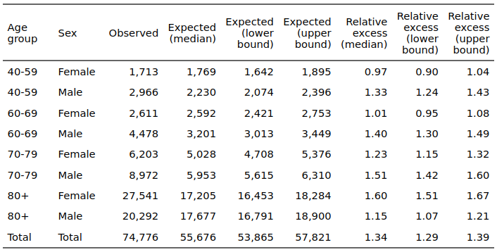
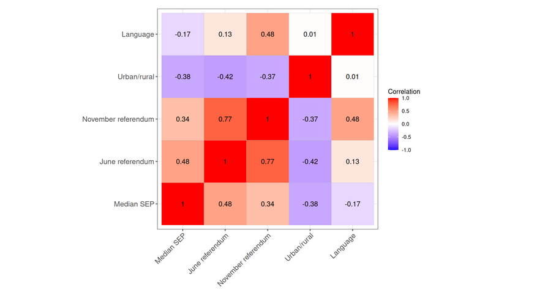

```{r setup, include=FALSE}
knitr::opts_chunk$set(echo = FALSE)
pacman::p_load(tidyverse, 
               scales,
               hrbrthemes, 
               sf, 
               INLA)

theme_set(theme_bw())

kt = read_rds("../data/BfS/kt.Rds")
tg3o = read_rds("../data/BfS/tg3o.Rds")
shap = list(kt=kt,tg3o=tg3o)

source("../R/helper_functions.R")
load("../results_inla/local_corr_models.Rdata")
load("../results_inla/data2.Rdata")
# model1.5_merg = readRDS("../results_inla/model1.5_merg.rds")
range_pop_obs = data1 %>% 
  group_by(GMDNAME) %>% 
  summarise(munici_pop=sum(munici_pop),munici_observed=sum(munici_observed))
```

## Background

-   Excess all-cause mortality is central to assessing the impact of the COVID-19 pandemic

-   Spatial granularity: country, region, canton, \alert{municipality?} (Staub et al. 2022, Konstantinoudis et al. 2022, Riou et al. 2023)

-   Association with \alert{local characteristics} (Bertoli et al. 2020, Brandily et al. 2021)

## Study aims

1.  Estimate excess all-cause mortality at the \alert{municipality level}

2.  Explore correlations with \alert{local characteristics}:

-   urbanisation

-   language region

-   vicinity of international borders

-   socioeconomic position

-   voting behavior for COVID-19 referendums

## Data

-   All-cause deaths by week, municipality, age, sex for \alert{2011-2020} from BFS (through Swiss National Cohort)

-   Temperature from ERA5

## Step 1: excess by municipality

The usual approach:

-   fit a regression model on 2011-2019

-   predict expected deaths for 2020 by week, municipality, age, sex

-   excess = observed - expected

-   **problem**: difficult to work with \alert{so many strata} (2,141 municipalities, 4 age groups, 2 sex groups $\rightarrow$ 17,128 strata)

## Step 1: excess by municipality

The chosen solution was to use \alert{downscaling}:

-   estimate expected at a higher level (canton) for the full year 2020

-   \alert{distribute} the expected deaths from the cantonal to the municipality level according to the observed distribution of deaths

-   random draws from a \alert{multinomial distribution} repeated 100 times

-   take the median

## Step 1: excess by municipality



## Step 1: excess by municipality

Mapping \alert{raw excess deaths} by municipality:

-   does not account for population size

```{r}
map_munic_raw(data2,shap, denom=NULL,fillname = "Excess deaths")
```

## Step 1: excess by municipality

Scale by \alert{population}:

-   does not account for population structure (age, sex...)

```{r}
map_munic_raw(data2,shap, denom="pop",fillname = "Excess deaths \nper population")
```

## Step 1: excess by municipality

Scale by expected mortality ($\rightarrow$ \alert{relative excess mortality}):

-   problems with zero denominators and small area estimation

```{r}
map_munic_raw(data2,shap, denom="expected")
```

## Step 2: local correlates of excess mortality

Explore correlations with local covariates:

-   yet another \alert{Poisson regression} model

-   let $O_{t,i,j,k}$ be the number of \alert{observed deaths} during week $t$ in municipality $i$, age group $j$ and sex group $k$

-   depends on the number of \alert{expected deaths} $E_{t,i,j,k}$

-   and a \alert{log-linear predictor} $\log \lambda = \alpha + \beta X$

$$
O_i \sim \text{Poisson}(\lambda E_i ) 
$$

## Step 2: local correlates of excess mortality

Other advantage:

-   stabilizes small area estimation using \alert{spatial models}

-   log link means that all effects are \alert{multiplicative}

\bigskip

\alert{Iterative model development}:

-   start simple and add complexity progressively

-   compare models with WAIC

## Model 1.0

We start with a \alert{baseline model} without covariates (only $\alpha$):

-   $\lambda = \exp(\alpha)$ can be interpreted as a relative excess mortality ($\lambda = O/E$)

Code:

`m1.0 = inla( observed ~ 1 + offset( expected ), ...)`

## Model 1.0

Results:

```{r}
round(exp(model1.0$summary.fixed)[c(1,3,5)],2)
```

\bigskip

-   this corresponds to the overall average relative excess

## Model 1.0

Check \alert{model fit} and residuals:

```{r}
cat("WAIC =",model1.0$waic$waic)
```

```{r, fig.height=5}
modelfit1(model1.0,data1,nf=20)
```

## Model 1.1

We expect that excess mortality \alert{differs by age and sex}:

-   added as a covariate (as everything multiplies)

Code:

```
m1.1 = inla( observed ~ -1 + 
                        sex:age_group + 
                        offset( expected ), 
             ...)
```

## Model 1.1

As expected, the relative excess mortality \alert{varies a lot} across age and sex groups:

```{r}
round(exp(model1.1$summary.fixed)[c(1,3,5)],2)
```

## Model 1.1

Big improvement of \alert{model fit}:

```{r}
cat("deltaWAIC =",model1.1$waic$waic - model1.0$waic$waic)
```

```{r, fig.height=5}
modelfit1(model1.1,data1,nf=20)
```

## Model 1.2

Allow for \alert{spatial variability}:

-   i.i.d. random effect by municipality

- all effects are pulled towards a \alert{global average}

- excess by municipality can vary independently from the others around this global average

- "municipality effect" applies \alert{the same} to all age and sex groups.

Code:

```
m1.2 = inla( observed ~ -1 + 
                        sex:age_group + 
                        f(id_space, model = "iid") + 
                        offset( expected ), 
             ...)
```

## Model 1.2

The age and sex effect remains similar:

```{r}
round(exp(model1.2$summary.fixed)[c(1,3,5)],2)
```


## Model 1.2

Again, improvement of \alert{model fit}:

```{r}
cat("deltaWAIC =",model1.2$waic$waic - model1.1$waic$waic)
```

## Model 1.2

Now we can look at the \alert{spatial variation}:

```{r}
map_munic(model1.2,data1,shap)
```

## Model 1.3

Structured spatial variability:

- municipalities are \alert{no longer independent}

- correlation between \alert{neighboring municipalities} with a BYM model

Code:

```
m1.2 = inla( observed ~ -1 + 
                        sex:age_group + 
                        f(id_space, model = "bym", ...) + 
                        offset( expected ), 
             ...)
```

## Model 1.3

Improvement of \alert{model fit}:

```{r}
cat("deltaWAIC =",model1.3$waic$waic - model1.2$waic$waic)
```


\bigskip

The proportion of \alert{"structured variability"} (as opposed to i.i.d) is high:

```{r}
round(model1.3$summary.hyperpar[2,c(1,3,5)],2)
```

## Model 1.3

Actual \alert{spatial variation}:

```{r}
map_munic(model1.3,data1,shap)
```

## Model 1.4

We now have a good model of excess mortality by municipality, we can add local \alert{covariates}:

-   \alert{urbanisation} 

-   \alert{socioeconomic position} 

-   \alert{international links} 

-   \alert{language region} 

-   voting behavior for \alert{COVID-19 referendums} (June and Nov 2020)


## Model 1.4a

For \alert{urbanisation}, FSO classifies Swiss municipalities in 3 classes (urban, peri-urban or rural):

```{r, fig.height=3.5, fig.width=6}
drivers_plot(model1.4a,data1)
```


## Model 1.4b

For \alert{socioeconomic position}, we take the median of the Swiss neighbourhood index of SEP, then transform into quintiles:

```{r, fig.height=3.5, fig.width=6}
drivers_plot(model1.4b,data1)
```

## Model 1.4c

For \alert{international links}, we assess whether municipality belongs to a *cross-border labor region* (FSO):

```{r, fig.height=3.5, fig.width=6}
drivers_plot(model1.4c,data1)
```


## Model 1.4d

For \alert{language regions}, we take the official language of each municipality:

```{r, fig.height=3.5, fig.width=6}
drivers_plot(model1.4d,data1)
```

## Model 1.4d

This one is not so easy: 

- the association is likely \alert{confounded by the way the first wave started} (in Ticino and the South-West)


```{r, fig.height=3.5, fig.width=6}
map_munic_lang(model1.3,data1,shap)
```


## Model 1.4d

Adding language region \alert{disrupts} the geographical variation observed before:

```{r, fig.height=3.5, fig.width=6}
map_munic(model1.4d,data1,shap)
```


## Model 1.4e

For \alert{voting behavior}, we take the proportion of Yes at the June 2020 referendum (November is very similar):

```{r, fig.height=3.5, fig.width=6}
drivers_plot(model1.4e,data1)
```


## Model 1.4e

November is very similar:

```{r, fig.height=3.5, fig.width=6}
drivers_plot(model1.4f,data1)
```

## Model 1.5

Multivariable analysis:

```{r, fig.height=3.5, fig.width=6}
drivers_plot_final(model1.4a,model1.4b,model1.4c,model1.4e,model1.5,data1)
```

## Model 1.5

\alert{Intercorrelation} between SEP and voting behaviour:

- impossible to disentengle between the two




## Model 1.5

\alert{Residual} municipality effect (after removing the effects of covariates):

```{r}
map_munic(model1.5,data1,shap)
```

## Model 1.5

- Expected higher excesses in Ticino and Southwestern Switzerland

- A visible \alert{barrier} between French-speaking and German-speaking regions

- Lower excess in the \alert{large cities of the German-speaking part} (Zurich, Basel, Bern)

- Lower excess in relatively \alert{isolated valleys} of Graubunden

## Conclusions

-   Small-area excess mortality \alert{varied substantially} in Switzerland in 2020, depending on the geographical location and type of municipality.

-   Areas most affected included Ticino, the Lake of Geneva region, the Jura and the Northeast of the country.

-   \alert{Rural} municipalities, municipalities of \alert{lower socioeconomic position} and showing \alert{lower support for COVID-19 control measures} experienced higher excess mortality.

